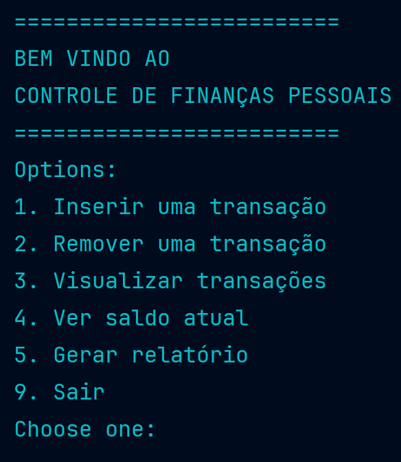
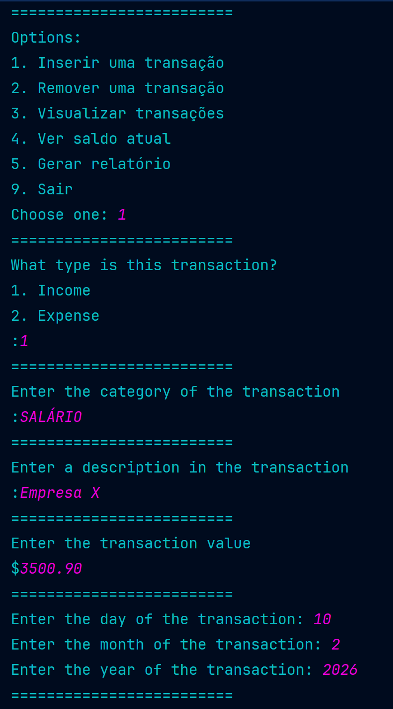
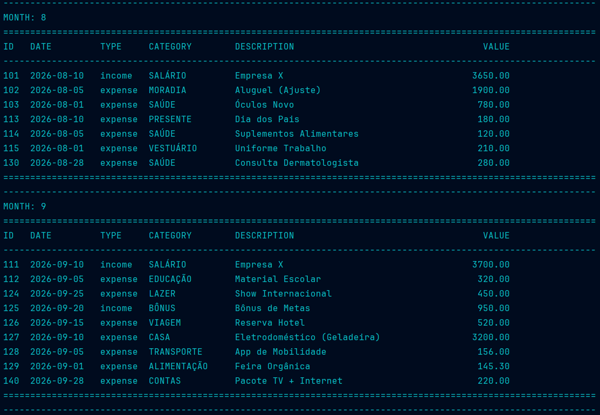

# Controle de Finanças Pessoais 

Sistema simples de controle de finanças pessoais via terminal, desenvolvido em Python.
Permite registrar **receitas e despesas**, listar transações, calcular **saldo atual** e gerar **relatório mensal**.

Este projeto foi estruturado com inspiração em **Clean Architecture**, separando responsabilidades em:
- **Model (domínio)**: entidades e contratos (interfaces)
- **Use Cases (casos de uso)**: regras e operações do sistema
- **Infrastructure**: persistência em CSV e conversões
- **UI (terminal)**: páginas/telas do menu e formatação de saída

---
## Autor
- Victor Bertolini de Sousa
  - Github: https://github.com/VictorBertolini
  - Linkedin: https://www.linkedin.com/in/victor-bertolini-de-sousa-6b8630394/
--- 

## Funcionalidades

- Registrar transação (tipo, categoria, descrição, valor, data)
- Remover transação por ID
- Listar transações:
  - todas
  - por mês
  - por categoria
  - por categoria em um mês
  - por ID
- Mostrar saldo atual
- Gerar relatório mensal:
  - total de entradas, saídas e saldo do mês
  - total geral no final

---

## Requisitos

- Python 3.10 ou superior

Sem bibliotecas externas

---

## Como Rodar

1) Clone o repositório
```shell
git clone https://github.com/VictorBertolini/personal-finance-control-python.git
```
2) Abra o terminal na página `Projeto Finanças Pessoais`
3) Execute o programa
```shell
python -m src.main
```

OBS: O programa cria automaticamente o arquivo CSV em `data/` se ele não existir

--- 

## Arquitetura 
- **model** – Entidades base do programa  
- **use_cases** – Ações do programa  
- **controllers** – Orquestram chamadas aos casos de uso  
- **infrastructure** – Persistência e serviços externos  
- **ui** – Interface do terminal


## Persistência (CSV)

### As transações são salvas em:

```shell
data/transactions.csv
```

### Formato por linha:
```csv
id,type,category,description,value,date
```

### Exemplo:
``` shell
1,income,SALARIO,Pagamento mensal,3500.00,2026-01-10
2,expense,MERCADO,Compras do mês,250.00,2026-01-12
```

## Amostra do programa:
### Início:


### Inserir Transação


### Mostrar todas as transações


### Filtrado por mês



